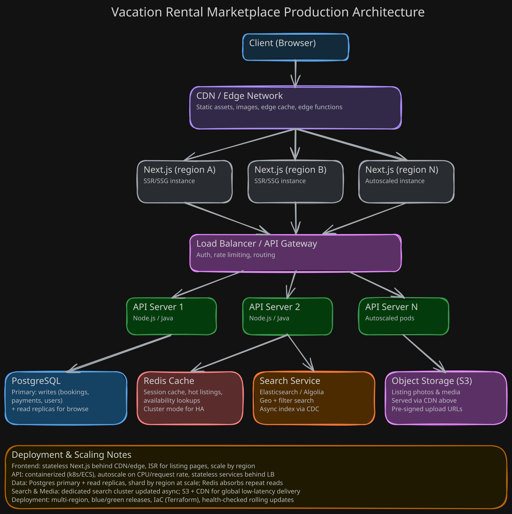

# 🏰 Airbnb Luxury Listing Page Clone

A pixel-perfect, highly accessible clone of the Airbnb Luxury Listing page built with **Next.js 16 (App Router)**, **React 19**, **Tailwind CSS v4**, and **TypeScript**.

Featuring an authentic Indian heritage stay — **"The Royal Aravalli Pavilion – Luxury Pool Villa & Spa"** in Udaipur, Rajasthan (priced in INR `₹`).

🔗 **Live Demo**: [https://airbnb-clone-by-sahilatahar.vercel.app/](https://airbnb-clone-by-sahilatahar.vercel.app/)

---

## ✨ Features

- **📸 Interactive Photo Tour Modal**:
    - Top visual room categories tab strip with thumbnail previews and live active indicators.
    - Sticky room titles and descriptions on the left, with compact single and side-by-side photo grids on the right.
    - Full keyboard accessibility: navigate between photos using <kbd>Arrow</kbd> keys or <kbd>Tab</kbd>, and press <kbd>Enter</kbd> or click to open full size.
    - Smooth jump-to-section scrolling.
- **🔍 Fullscreen Lightbox Viewer**:
    - High-resolution single-image viewer with keyboard arrow navigation (<kbd>←</kbd> / <kbd>→</kbd>).
    - Thumbnail preview strip and image counter.
    - Seamlessly returns back to the Photo Tour at the exact scroll position.
- **🛡️ Locked Body Scrolling**:
    - Reliable `.modal-open` background lock ensuring the document body never scrolls underneath active overlays.
- **♿ First-Class Accessibility (a11y)**:
    - Focus trap in all modals: <kbd>Tab</kbd> and <kbd>Shift</kbd> + <kbd>Tab</kbd> cycling.
    - Automatic focus management on open and restore on close.
    - Complete ARIA dialog semantics (`role="dialog"`, `aria-modal="true"`, `role="tablist"`, `aria-selected`).
    - Visible focus rings (`focus-visible:ring-2`) for keyboard-first navigation.
- **📅 Dual-Month Interactive Calendar**:
    - Date range selection with automatic night calculation and clear actions.
- **💳 Sticky Booking Widget**:
    - Sticky right-side reservation card with guest selector popover, price breakdown, coupon claim discount, and reservation status.
- **🌟 Guest Favourite & Rating Breakdown**:
    - Overall rating with 5-star distribution bars and category ratings (Cleanliness, Accuracy, Check-in, Communication, Location, Value).
    - Filterable review tags.
- **💬 Modals & Dialogs**:
    - **All Amenities Modal**: Categorized checklist of 50+ property amenities.
    - **All Reviews Modal**: Searchable customer review list with rating filter.
    - **Share Modal**: One-click link copying, WhatsApp, and Email sharing.
- **🎠 Bottom Stays Carousel**:
    - Smooth page-based carousel with immediate disabled state handling on edges.

---

## 🛠️ Tech Stack

- **Framework**: [Next.js 16](https://nextjs.org/) (App Router & Turbopack)
- **Library**: [React 19](https://react.dev/)
- **Styling**: [Tailwind CSS v4](https://tailwindcss.com/)
- **Icons**: [Lucide React](https://lucide.dev/)
- **Language**: [TypeScript](https://www.typescriptlang.org/)
- **Code Formatting**: [Prettier](https://prettier.io/) with `prettier-plugin-tailwindcss`

---

## 🏗️ Production Architecture

<p align="center">
  <picture>
    <source media="(prefers-color-scheme: dark)" srcset="./images/production-architecture-dark.svg">
    <source media="(prefers-color-scheme: light)" srcset="./images/production-architecture.svg">
    
  </picture>
</p>

---

## 📁 Project Structure

```text
airbnb-clone/
├── app/
│   ├── globals.css          # Global CSS & Tailwind v4 theme definitions
│   ├── layout.tsx           # Root layout metadata & typography
│   └── page.tsx             # Main listing page orchestration & state
├── components/
│   ├── index.ts             # Clean barrel export for all components
│   ├── layout/
│   │   ├── Navbar.tsx       # Top navigation header with search bar & menu
│   │   ├── Footer.tsx       # Global footer with currency & language selector
│   │   └── StickyTabBar.tsx # rAF-throttled sticky navigation bar on scroll
│   ├── modals/
│   │   ├── PhotoTourModal.tsx   # Fullscreen photo tour gallery
│   │   ├── LightboxModal.tsx    # Single-photo lightbox viewer
│   │   ├── AllAmenitiesModal.tsx# Complete categorized amenities dialog
│   │   ├── AllReviewsModal.tsx  # Searchable reviews modal
│   │   └── ShareModal.tsx       # Social & link share dialog
│   └── sections/
│       ├── HeroGallery.tsx          # 5-photo hero gallery grid
│       ├── ListingSummary.tsx       # Property specs & host header
│       ├── KeyHighlights.tsx        # High-level stay amenities
│       ├── DescriptionSection.tsx   # Expandable listing description
│       ├── WhereYoullSleep.tsx      # Bedroom arrangements
│       ├── AmenitiesSection.tsx     # Featured amenities grid
│       ├── CalendarSection.tsx      # Dual month date picker
│       ├── StickyBookingWidget.tsx  # Sticky reservation card with coupon
│       ├── GuestFavouriteSection.tsx# Rating breakdown & category scores
│       ├── ReviewsSection.tsx       # 2-column review comments
│       ├── LocationSection.tsx      # Map & neighbourhood highlights
│       ├── MeetYourHost.tsx         # Host stats & co-hosts
│       ├── ThingsToKnow.tsx         # Policies & safety details
│       └── NearbyStays.tsx          # Paginated nearby stays carousel
├── hooks/
│   ├── index.ts             # Barrel export for custom hooks
│   ├── useClickOutside.ts   # Click outside & Escape key listener
│   └── useScrollLock.ts     # Modal body/HTML scroll locking hook
├── images/
│   ├── production-architecture-dark.svg # Dark theme architecture diagram
│   └── production-architecture.svg      # Light theme architecture diagram
└── data/
    └── listingData.ts       # Structured property data, photos & reviews
```

---

## 🚀 Getting Started

### Prerequisites

Ensure you have [Node.js](https://nodejs.org/) (v18.17+ or v20+) installed.

### Installation

1. Clone the repository:

    ```bash
    git clone https://github.com/sahilatahar/airbnb-clone.git
    cd airbnb-clone
    ```

2. Install dependencies:

    ```bash
    npm install
    ```

3. Start the development server:

    ```bash
    npm run dev
    ```

4. Open [http://localhost:3000](http://localhost:3000) in your browser.

---

## 📦 Available Scripts

- `npm run dev` — Starts the Next.js development server.
- `npm run build` — Creates an optimized production build.
- `npm run start` — Starts the production server.
- `npm run format` — Formats the entire codebase with Prettier.
- `npm run format:check` — Verifies code formatting rules.
